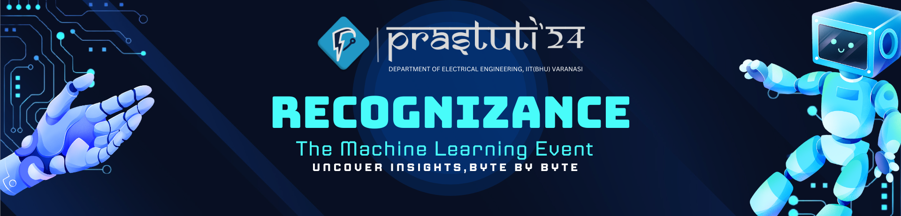

# Recognizance'24

Recognizance is the machine learning event hosted by [Prastuti](https://www.prastuti.in/), the annual fest of IIT (BHU) Varanasi's Electrical Engineering department. With multiple workshops and series of talks, it ignites minds by providing hands-on experience through practical challenges and workshops, allowing participants to test their skills and build real-world projects. Starting from the basics of machine learning and data science, it goes on to cover advanced topics like computer vision and LLMs.

[Click Here](https://www.prastuti.in/recognizance) to register for Recognizance 2024.

[Click here](https://recognizance24.notion.site/Prastuti-24-Recognizance-Resources-1ed5c2fb876f434bbdf36b9090879a0b?pvs=4) to access resources of Recognizance'24.

# Workshops

1. [Introduction to Pythonand its Libraries]()
2. _Coming Soon_

# Social Media

- [Youtube Channel](https://www.youtube.com/@prastuti2023)
- [LinkedIn Page](https://www.linkedin.com/company/prastuti/)
- [Instagram handle](https://www.instagram.com/prastuti.iitbhu/)
- [Facebook page](https://www.facebook.com/prastuti.iitbhu)
